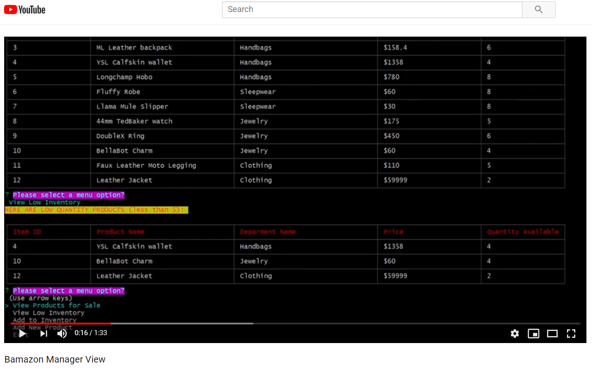
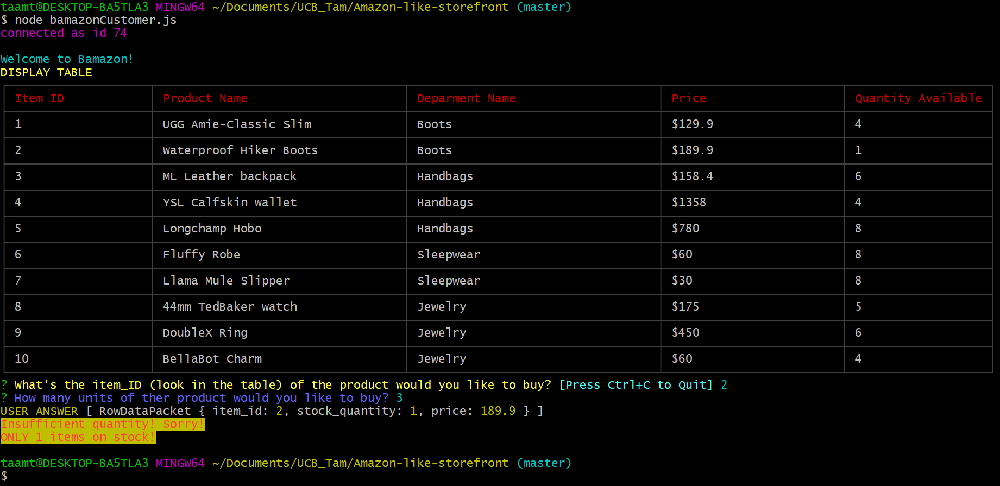

# Amazon-like-storefront

<h3>Overview</h3> 
Amazon-like storefront with the MySQL skills you learned this unit. The app will take in orders from customers and deplete stock from the store's inventory.

 

 

### Demo:

<h1>Manager View</h1>

***Click for
[![Manager View]](https://youtu.be/foAwiWnfRnQ)

<h1>Customer View</h1>

***Click for
[![Customer View]](https://youtu.be/jscFTkR7lCU)

<h3>Customer Purchase</h3>

The first should ask them the ID of the product they would like to buy.

The second message should ask how many units of the product they would like to buy

   
<h5>Insufficient quantity</h5>

<h3>Build with:</h3>
<ul>

<li>Javascript
<li>Node.js (https://nodejs.org/en) - Framework used
<li>MySQL WorkBench (https://www.mysql.com/products/workbench/) 
<li>JSON (http://www.json.org) - Data format used
 
   * [mySQL](https://www.npmjs.com/package/mysql)

   * [Inquirer](https://www.npmjs.com/package/inquirer)

   * [Table](https://www.npmjs.com/package/cli-table)

   * [Chalk](https://www.npmjs.com/package/chalk)
   
   
      
