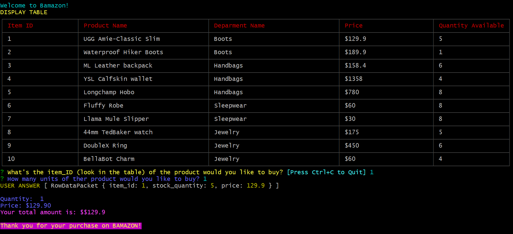

# Amazon-like-storefront

<h3>Overview</h3> 
Amazon-like storefront with the MySQL skills you learned this unit. The app will take in orders from customers and deplete stock from the store's inventory.

 

 

(https://tamtr89.github.io/Amazon-like-storefront/)

<h4>Customer View</h4>

  
<h3>Build with:</h3>
<ul>

<li>Javascript
<li>Node.js (https://nodejs.org/en) - Framework used
<li>JSON (http://www.json.org) - Data format used
 
   * [mySQL](https://www.npmjs.com/package/mysql)

   * [inquirer](https://www.npmjs.com/package/inquirer)

   * [Table](https://www.npmjs.com/package/cli-table)

   * [Chalk](https://www.npmjs.com/package/chalk)
   
   
      
